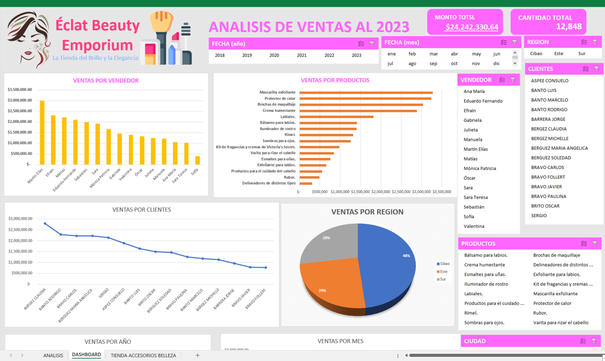

# BASE_DE_DATO_DE_PRODUCTOS_Y_ACCESORIOS_DE_BELLAS_EN_EXCEL
BASE DE DATOS DE PRODUCTOS Y ACCESORIOS DE BELLAS

😊🎉 ¡Bienvenidos a mi canal de YouTube! En este emocionante video tutorial, descubrirás cómo 💡utilizar tablas dinámicas en Excel💡 para llevar tu análisis de datos al siguiente nivel y crear un 🚀impresionante dashboard🚀. ¿El objetivo? 💄Analizar datos de una tienda de accesorios y productos de belleza💄 para obtener información valiosa y presentarla de manera visualmente atractiva. 💼👠

✅Desde  la creación de tablas dinámicas y la elaboración de gráficos interactivos, exploraremos juntos cada paso para que puedas dominar estas poderosas herramientas de análisis. 📈💻

✅¡No importa si eres un principiante o un experto en Excel! Este tutorial te brindará el conocimiento necesario para tomar decisiones informadas y presentar tus hallazgos de manera profesional. 🎓📊

👨‍🎓Prepárate para desbloquear el potencial oculto en tus datos y crear un dashboard que te permitirá tomar decisiones inteligentes y visualizar el rendimiento de tu tienda de 👨‍🎓👍manera efectiva. 💪🔍

👍❤No te pierdas esta emocionante aventura de análisis de datos y creación de dashboards en Excel. ¡Dale clic al botón de "Me gusta" y suscríbete para no perderte ninguna de nuestras futuras actualizaciones! ¡Comencemos! 🎬🚀

🎬-VER VIDEO EN YOUTUBE: https://www.youtube.com/watch?v=Y8Xc-jwzNJk&ab_channel=JuancitoPe%C3%B1aV.

